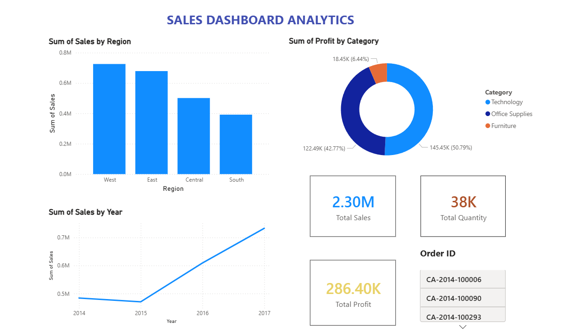

# Sales Dashboard Analytics Project

## Overview

This project is an interactive business intelligence dashboard developed using Power BI.

The dashboard analyzes:
- Sales performance
- Regional trends
- Profit distribution
- Business KPIs

using structured sales datasets and visualization techniques.

---

## Dashboard Preview



---

## Features

- Sales by Region analysis
- Profit by Category visualization
- KPI Cards for Sales, Profit, and Quantity
- Monthly sales trend analysis
- Interactive dashboard visuals

---

## Technologies Used

- Power BI
- Data Visualization
- Business Intelligence
- KPI Reporting
- Data Analytics

---

## Dataset

The project uses a retail sales dataset containing:
- Sales
- Profit
- Category
- Region
- Quantity
- Order Date

---

## Project Structure

```text
sales-dashboard-project
│
├── sales-dashboard.pbix
├── SampleSuperstore.csv
├── README.md
└── screenshots
      └── dashboard.png
````

---

## Key Learnings

* Dashboard development
* KPI reporting
* Data visualization
* Business analytics
* Power BI fundamentals

---

## Author

Vikas Basa

```
```
